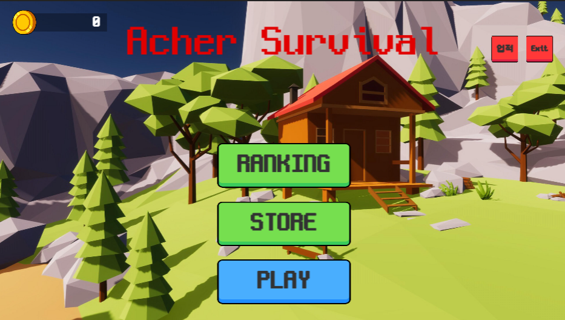
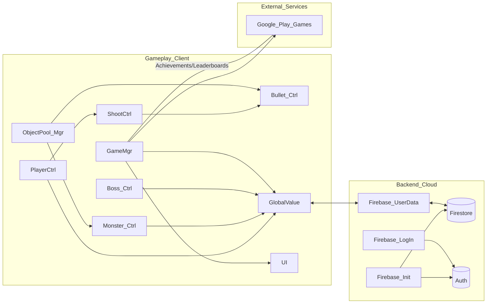

# Archer Survival — 기술 소개서

> Unity 기반 모바일 생존형 액션 RPG  
> Firebase & Google Play Games Services(GPGS) 연동 · 오브젝트 풀링(Object Pooling) 최적화 · 자동 전투 · 레벨업 & 스킬 성장 루프

---

## 목차
- [개요](#개요)
- [핵심 기능](#핵심-기능)
- [개발 환경](#개발-환경)
- [아키텍처](#아키텍처)
- [폴더 구조](#폴더-구조)
- [구현 상세](#구현-상세)
  - [1) 계정/데이터 (Firebase)](#1-계정데이터-firebase)
  - [2) 업적/랭킹 (GPGS)](#2-업적랭킹-gpgs)
  - [3) 전투/자동타겟팅/총알](#3-전투자동타겟팅총알)
  - [4) 오브젝트 풀링](#4-오브젝트-풀링)
  - [5) 레벨업/스킬 시스템](#5-레벨업스킬-시스템)
- [최적화 포인트](#최적화-포인트)
- [문제 해결](#문제-해결)
- [빌드 & 배포](#빌드--배포)
- [향후 계획](#향후-계획)
- [라이선스](#라이선스)

---

## 개요
- **장르:** 모바일 생존형 액션 RPG  
- **핵심 목표:** Firebase + GPGS로 계정/데이터/업적 안정 연동, 오브젝트 풀링으로 저사양 기기에서도 프레임 안정화, 자동 전투 + 레벨업 + 스킬 선택으로 빠른 성장감 제공  

  

---

## 핵심 기능
- **계정 시스템:** Firebase Auth(이메일/비밀번호), Google Play Games 로그인 지원  
- **데이터 동기화:** Firestore에 유저별 코인/아이템/업적 저장 및 로드  
- **전투/AI:** 자동 타겟팅 & 발사, 보스 패턴(돌진/360도 등)  
- **성장 루프:** EXP → 레벨업 → 스킬 선택(예: `FireBall`, `FireBall_FF`)  
- **최적화:** 총알/몬스터/EXP/코인에 오브젝트 풀 적용으로 GC/프레임 드랍 최소화  

📌 **추천 삽입 포인트**  
- 기능별 UI/게임플레이 캡처 (예: 로그인 UI, 전투 화면, 스킬 선택 화면)

---

## 개발 환경
- **엔진/언어:** Unity `2022.3.15f1`, C#  
- **서비스 연동:** Firebase(`Auth`, `Firestore`), Google Play Games Services  
- **플랫폼:** Android(`minSdk` 프로젝트 설정 기준, `compileSdk 34` 대응)  

📌 **추천 삽입 포인트**  
- Unity 버전/빌드 세팅 화면 (`docs/assets/build-settings.png`)

---

## 아키텍처
- **Gameplay:** `PlayerCtrl`, `ShootCtrl`, `Bullet_Ctrl`, `Monster_Ctrl`, `Boss_Ctrl`, `ObjectPool_Mgr`, `GameMgr`, `GlobalValue`  
- **Backend:** `Firebase_Init` → `Firebase_LogIn` → `Firebase_UserData`  
- **GlobalValue:** 전역 상태 관리 + Firestore 동기화  

<!-- Mermaid 다이어그램 -->

## 폴더 구조
- `Assets/01.Scripts/Managers`: `GameMgr`, `ObjectPool_Mgr`  
- `Assets/01.Scripts/Gameplay`: `PlayerCtrl`, `ShootCtrl`, `Bullet_Ctrl`, `Monster_Ctrl`, `Boss_Ctrl`  
- `Assets/01.Scripts/Systems`: `GlobalValue`, UI 관리  
- `Assets/01.Scripts/Backend`: `Firebase_Init`, `Firebase_LogIn`, `Firebase_UserData`  
- `StreamingAssets`: `google-services.json`  
- `docs/assets`: 문서용 이미지  

📌 **추천 삽입 포인트**  
- 실제 프로젝트 폴더 스크린샷

---

## 구현 상세

### 1) 계정/데이터 (Firebase)
- **인증:** Firebase Auth로 이메일/비밀번호 로그인, GPGS 로그인 연동  
- **저장/로드:** Firestore에 코인, 아이템, 업적 저장 → 앱 시작 시 로드  
- **흐름:** Init → Login → UserData 로드 → 진행 중 데이터 저장  

📌 **추천 삽입 포인트**  
- Firebase Auth 로그인 코드 조각  
- Firestore에 저장된 JSON 문서 예시  
- Firebase 콘솔 스크린샷 (`docs/assets/firebase-flow.png`)

---

### 2) 업적/랭킹 (GPGS)
- **초기화:** `PlayGamesPlatform.Activate()`로 GPGS 인증  
- **업적 달성:** `Social.ReportProgress(achievementId, 100.0, ...)` 호출  
- **리더보드:** `Social.ShowLeaderboardUI()`로 표시  

📌 **추천 삽입 포인트**  
- 업적 달성 시도 코드 조각  
- 리더보드 UI 캡처 화면

---

### 3) 전투/자동타겟팅/총알
- **타겟팅:** `ShootCtrl` → 가까운 몬스터 탐색, 방향 계산  
- **투사체:** `Bullet_Ctrl` → 전진, 수명, 충돌 처리 후 풀 반환  
- **적 처리:** `Monster_Ctrl` → 추적, 피격, 사망 시 아이템 드랍  

📌 **추천 삽입 포인트**  
- `ShootCtrl.FindNearestEnemy()` 코드 조각  
- 총알 발사 코드 (FirePos 사용)  
- 전투 루프 다이어그램 (`docs/assets/combat-loop.png`)

---

### 4) 오브젝트 풀링
- **목표:** `Destroy()` 최소화 → GC/프레임 드랍 제거  
- **매니저:** `ObjectPool_Mgr` → `Get(key)`, `Return(obj)` 관리  
- **적용 범위:** 총알, 몬스터, EXP/코인 등  

📌 **추천 삽입 포인트**  
- 풀링 매니저 코드 조각 (`Get`/`Return`)  
- 풀링 구조 이미지 (`docs/assets/pooling.png`)

---

### 5) 레벨업/스킬 시스템
- **EXP 누적:** 몬스터 처치 → EXP 아이템 드랍 → 획득  
- **레벨업:** 임계치 도달 시 레벨 증가, 남은 EXP 이월  
- **스킬 선택:** UI 표시 → 선택 즉시 반영  
- **예시 스킬:** `FireBall_FF`: 직전 발사 수만큼 추가 발사  

📌 **추천 삽입 포인트**  
- `GlobalValue.AddExp()` 코드 조각  
- FireBall_FF 추가 발사 처리 코드  
- 레벨업/스킬 선택 UI 캡처 (`docs/assets/levelup-skill.png`)

---

## 최적화 포인트
- **Destroy 최소화:** 풀링 + `OnEnable` 초기화  
- **Update 최적화:** 탐색 주기/반경 조정, 캐싱, 쿨다운 사용  
- **Physics:** 충돌 매트릭스 최적화  
- **UI:** 값 변경 이벤트 기반 갱신  

📌 **추천 삽입 포인트**  
- 풀링 적용 전/후 프로파일러 비교 캡처

---

## 문제 해결
- **Firebase 초기화 실패:** `google-services.json` 경로/포맷 수정  
- **GPGS/Gradle 충돌:** `compileSdkVersion` 조정, gradle.properties 수정  
- **프레임 드랍:** `Destroy()` 남발 → 풀링 전환  
- **AI 타겟팅 문제:** 캐싱 및 널 가드 처리  

📌 **추천 삽입 포인트**  
- 에러 로그/Logcat 캡처 (`docs/assets/debug-errors.png`)  
- 문제 발생 전후 비교 이미지

---

## 빌드 & 배포
- **환경:** Unity 2022.3.15f1 · Android SDK API 32+  
- **절차:**  
  - APK/AAB 빌드  
  - Keystore 서명  
  - Google Play Console 업로드(버전 코드 증가)  
  - GPGS 업적/리더보드 ID 연결, SHA-1 등록  

📌 **추천 삽입 포인트**  
- Build Settings 캡처 (`docs/assets/build-settings.png`)  
- Google Play Console 업로드 화면

---

## 향후 계획
- **멀티플레이 지원** (실시간/협동 모드)  
- **콘텐츠 확장**: 신규 보스/스테이지, 이벤트 시스템  
- **경쟁 강화**: 주간/월간 랭킹, 업적 세분화  
- **데이터 품질**: 클라우드 세이브 충돌 해결/머지  
- **UX 개선**: 접근성 옵션(진동, 색각 보정) 추가  

---

## 라이선스
- **MIT License**: 자유로운 사용/수정/배포 가능 (자세한 내용은 LICENSE 파일 참조)
